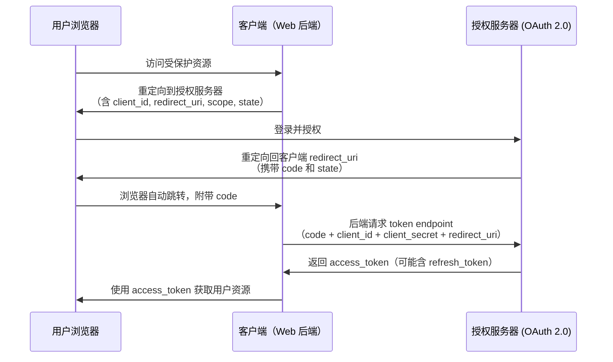
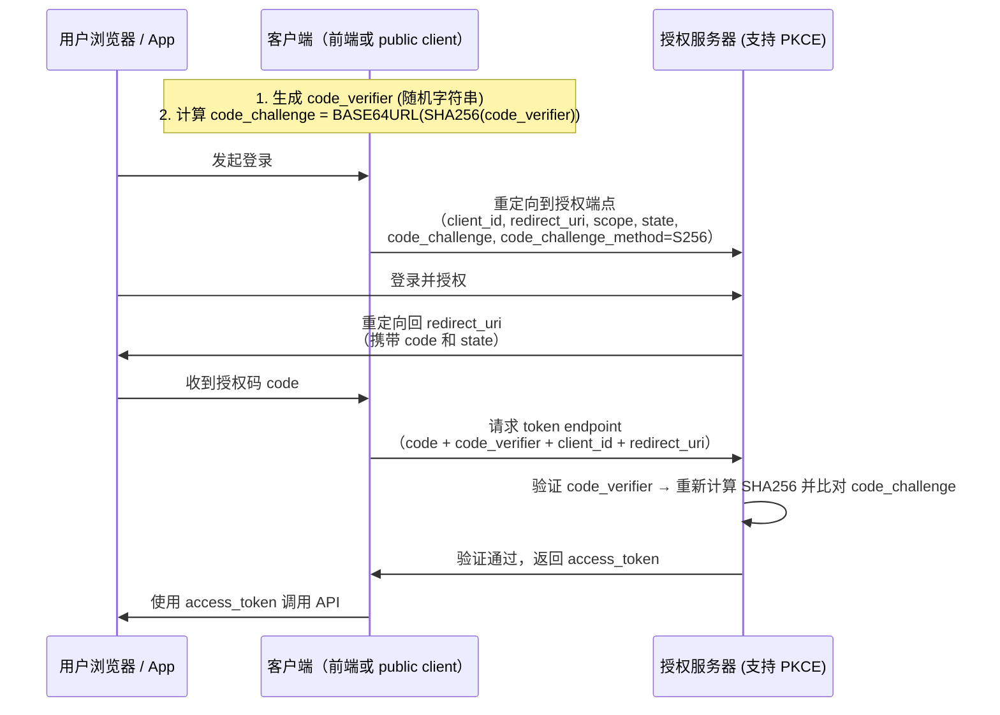

## OAuth 2.0 与 OAuth 2.1 的区别

### 1. 背景

- **OAuth 2.0**：发布于 2012 年（RFC 6749），是目前广泛使用的授权框架。
- **OAuth 2.1**：并非一个全新的协议，而是对 OAuth 2.0 的**安全强化和最佳实践整合**。它由 OAuth 工作组在 2021 年左右提出（目前仍是草案，但已被广泛采纳为事实标准）。

> 📌 注意：OAuth 2.1 并不是 RFC，而是对 OAuth 2.0 多个扩展（如 PKCE、Bearer Token 安全性等）的**整合与弃用不安全实践**的总结。

### 2. 主要区别

| 特性                                            | OAuth 2.0                   | OAuth 2.1                                     |
| --------------------------------------------- | --------------------------- | --------------------------------------------- |
| **隐式模式（Implicit Grant）**                      | ✅ 支持（`response_type=token`） | ❌ **明确弃用**（因安全风险）                             |
| **密码模式（Resource Owner Password Credentials）** | ✅ 支持                        | ❌ **弃用**（仅限遗留系统）                              |
| **客户端凭证模式（Client Credentials）**               | ✅ 保留                        | ✅ 保留（用于服务间通信）                                 |
| **授权码模式（Authorization Code）**                 | ✅ 支持                        | ✅ **强制要求配合 PKCE**（即使 confidential client 也推荐） |
| **PKCE（Proof Key for Code Exchange）**         | 可选扩展（RFC 7636）              | ✅ **强制要求所有客户端使用**                             |
| **重定向 URI 要求**                                | 建议严格匹配                      | ✅ **必须精确匹配**（防止开放重定向攻击）                       |
| **State 参数**                                  | 推荐使用                        | ✅ **必须使用**（防 CSRF）                            |
| **令牌传输安全性**                                   | 建议 HTTPS                    | ✅ **强制要求 HTTPS**                              |

### 3. 核心理念变化

- OAuth 2.1 的目标是：**“默认安全”**。
- 它移除了历史上被证明不安全的授权方式（如隐式模式），并强制使用现代安全机制（如 PKCE）。
- 即使你是 confidential client（有后端、能安全存储 client\_secret），OAuth 2.1 也**推荐使用 PKCE**，以统一实现并防御授权码拦截攻击。

***

## PKCE 模式 vs 授权码模式

这个问题其实有点“类别混淆”——**PKCE 不是一种独立的授权模式，而是对授权码模式的增强**。

### 1. 授权码模式（Authorization Code Flow）

- **适用场景**：Web 应用（有后端）、传统 OAuth 2.0。

- **流程简述**：
  1. 用户访问客户端 → 重定向到授权服务器（带 `client_id`, `redirect_uri`, `scope`, `state`）。
  2. 用户登录并授权。
  3. 授权服务器重定向回客户端，携带 `code`。
  4. 客户端后端用 `code + client_secret` 向授权服务器换取 `access_token`。

- **安全前提**：客户端必须是 **confidential client**（能安全存储 `client_secret`）。

### 2. PKCE（Proof Key for Code Exchange）

- **目的**：解决 **public client**（如 SPA、移动 App）无法安全存储 `client_secret` 的问题。
- **核心思想**：用动态生成的“代码验证器”（code\_verifier）和其哈希（code\_challenge）替代 `client_secret`。

#### PKCE 流程（叠加在授权码模式上）：

1. 客户端生成一个随机字符串 `code_verifier`。
2. 对其进行 SHA256 哈希，得到 `code_challenge`。
3. 在第一步授权请求中，带上 `code_challenge` 和 `code_challenge_method=S256`。
4. 用户授权后，拿到 `code`。
5. 客户端在兑换 token 时，**提交原始的 `code_verifier`**。
6. 授权服务器用 `code_verifier` 重新计算哈希，与之前存储的 `code_challenge` 比对。

✅ 这样即使攻击者截获了 `code`，也无法兑换 token（因为没有 `code_verifier`）。

### 3. 关键区别总结

| 维度                   | 授权码模式（传统）                               | 授权码 + PKCE                              |
| -------------------- | --------------------------------------- | --------------------------------------- |
| 是否需要 `client_secret` | ✅ 需要（confidential client）               | ❌ 不需要（适用于 public client）                |
| 安全性                  | 依赖 `client_secret` 保密                   | 依赖动态 `code_verifier`（每次不同）              |
| 适用客户端类型              | Web 后端应用                                | SPA、移动 App、桌面应用、甚至 Web 应用（OAuth 2.1 推荐） |
| 是否防授权码拦截             | ❌ 若 `code` 被截获且攻击者有 `client_secret`，可盗用 | ✅ 即使 `code` 被截获，无 `code_verifier` 也无法使用 |

> 💡 现代最佳实践（包括 OAuth 2.1）：**所有授权码流程都应使用 PKCE**，无论是否是 public client。

***

## 总结

- **OAuth 2.1 ≠ 全新协议**，而是 OAuth 2.0 的**安全加固版**，弃用不安全模式，强制 PKCE 和 HTTPS。
- **PKCE 不是替代授权码模式，而是其安全增强**，用于防止授权码被滥用，尤其适用于无法保密 `client_secret` 的场景。
- **现代应用应一律使用“授权码 + PKCE”**，即使是后端服务。
